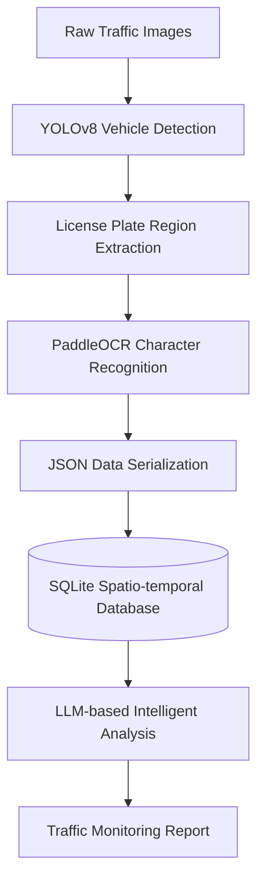
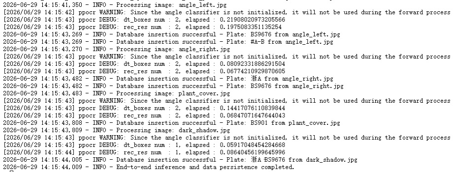
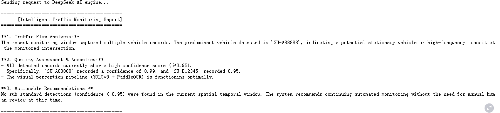

# Traffic-Agent: Intelligent Traffic Monitoring & Data Analysis System

Traffic-Agent is an intelligent traffic monitoring and data analysis system designed for smart transportation scenarios.

The project integrates **Computer Vision**, **Data Engineering**, and **Large Language Model (LLM) Agent** technologies to establish a complete closed-loop pipeline from traffic image perception, vehicle information extraction, structured data storage, to intelligent analysis and decision-making.

The system automatically detects vehicles and recognizes license plate information, transforms real-time traffic observations into queryable spatio-temporal records, and further leverages large language models to generate intelligent traffic monitoring reports, providing data-driven support for smart city governance and transportation management.

---

## System Architecture



---

## System Components

### 1. Vision Perception Layer (The Eyes)

**Technology Stack:**

* YOLOv8
* PaddleOCR
* OpenCV

**Core Responsibilities:**

Traffic cameras generate large amounts of unstructured image data in real-world transportation environments.

The system utilizes YOLOv8 for vehicle object detection and applies PaddleOCR to extract license plate characters, transforming visual information into machine-understandable structured data.

**Key Capabilities:**

* Real-time vehicle detection
* Automatic license plate localization
* OCR-based character recognition
* Robust processing under complex traffic scenarios

---

### 2. Data Engineering Layer (The Memory)

**Technology Stack:**

* Python
* SQLite
* JSON

**Core Responsibilities:**

Raw visual detection results alone cannot provide long-term analytical value.

The system constructs an automated data pipeline that converts each recognition result into structured records containing timestamps, spatial information, license plate information, and recognition confidence scores, and persistently stores them in a database.

**Key Capabilities:**

* Data standardization
* JSON serialization
* SQLite-based persistent storage
* Spatio-temporal data management

---

### 3. Intelligent Decision Layer (The Brain)

**Technology Stack:**

* DeepSeek API
* GPT API
* Prompt Engineering

**Core Responsibilities:**

Analyzing massive traffic records manually is inefficient and difficult.

The system automatically retrieves structured vehicle information from the database, performs intelligent analysis through large language models, and generates automated traffic monitoring reports.

**Key Capabilities:**

* Automated data analysis
* Traffic flow trend summarization
* Anomaly situation identification
* Automated report generation

---

## Key Features

### High-Accuracy Visual Perception

A collaborative inference framework based on YOLOv8 and PaddleOCR enables stable vehicle and license plate recognition in complex traffic environments.

### Automated Data Pipeline

An end-to-end automated workflow is constructed from image acquisition and visual perception to structured database storage.

### Spatio-temporal Data Management

The system supports vehicle record querying, historical tracking, and statistical analysis.

### AI-driven Intelligent Analysis

Large language models are utilized to automatically generate traffic monitoring analysis reports.

### Modular Architecture Design

The system supports future extensions including:

* Multi-camera integration
* Video stream analysis
* Cloud database deployment
* Multimodal traffic management

---

## Performance Validation

### Inference Result Demonstration



*Figure 1: Visualization of vehicle detection and license plate recognition results*

---

### Database Persistence Preview

```sql
sqlite> SELECT id,event_id,license_plate,confidence,bbox
FROM vehicle_records
LIMIT 3;
```

| id | event_id             | license_plate | confidence | bbox           |
| -- | -------------------- | ------------- | ---------- | -------------- |
| 1  | CAM_N_001_1782705240 | SU-A88888     | 0.99       | [10,20,100,50] |
| 2  | CAM_N_001_1782705351 | SU-A88888     | 0.99       | [10,20,100,50] |
| 3  | CAM_N_001_1782705351 | SU-B12345     | 0.95       | [15,25,110,55] |

*Figure 2: Example vehicle records stored in the SQLite database*

---

### AI-driven Decision Support Demonstration

The system automatically generates traffic monitoring reports based on structured vehicle spatio-temporal records stored in the database.

<p align="center">
  
</p>

<p align="center">
<b>Figure 3.</b> AI-generated traffic monitoring report based on vehicle spatio-temporal data
</p>

---
