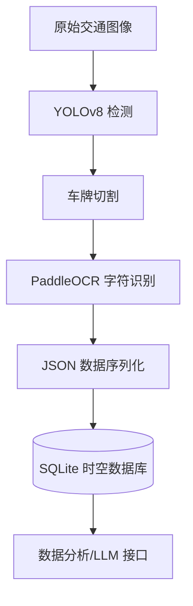

# Traffic-Agent: Intelligent Traffic Monitoring & Data Analysis System

Traffic-Agent 是一个面向智能交通管理的高性能端到端车牌识别（ALPR）系统。本项目集成了先进的计算机视觉感知模型与结构化时空数据库，旨在实现实时车辆检测、车牌提取及自动数据归档。

##  系统架构 (System Architecture)

本系统采用模块化设计，通过解耦感知层、数据处理层和持久化层，确保了系统的高扩展性与稳定性：



##  核心功能 (Key Features)

### 高精度视觉感知

基于 YOLOv8 深度优化模型，在复杂光照和遮挡环境下实现实时车牌定位。

### 鲁棒字符识别

集成 PaddleOCR 引擎，具备处理多样化车牌格式的高效字符提取能力。

### 结构化数据持久化

自动化 SQLite 数据流管线，将视觉识别结果映射为结构化 JSON，支持高效的时空查询。

### 工业级鲁棒性

内置错误处理机制，有效应对边界场景，确保端到端流程的高可用性。

---

##  AI-Driven Insights

Beyond vehicle detection and data persistence, Traffic-Agent incorporates a Large Language Model (LLM) to transform structured traffic records into actionable intelligence.

By analyzing vehicle trajectories, traffic density, and temporal patterns stored in the SQLite database, the system can automatically generate professional daily monitoring reports, enabling efficient traffic management and reducing manual analysis workload.

<p align="center">
  
</p>

<p align="center">
<b>Figure 3.</b> LLM-generated daily traffic monitoring report based on structured vehicle records.
</p>


##  性能验证 (Performance & Results)

### 推理效果演示


*Figure 1. Real-time Vehicle Detection and OCR Recognition Results*

```text
README/images/detection_result.png
```


### 数据库持久化预览

```sql
sqlite> SELECT id,event_id,license_plate,confidence,bbox
FROM vehicle_records
LIMIT 3;
```

| id | event_id | license_plate | confidence | bbox |
|----|-----------|---------------|------------|------|
| 1 | CAM_N_001_1782705240 | SU-A88888 | 0.99 | [10,20,100,50] |
| 2 | CAM_N_001_1782705351 | SU-A88888 | 0.99 | [10,20,100,50] |
| 3 | CAM_N_001_1782705351 | SU-B12345 | 0.95 | [15,25,110,55] |

*Figure 2. Example records persisted in the SQLite database.*

```text
README/images/database_preview.png
```


---

##  快速上手 (Quick Start)

### 1. 环境依赖

确保已配置好 PyTorch 及 PaddlePaddle 运行环境：

```bash
pip install -r requirements.txt
```

### 2. 运行推理

启动全流程数据管道，处理本地图像并自动入库：

```bash
python main_inference.py
```

### 3. 数据查询

验证数据库中已存储的车辆记录：

```bash
sqlite3 traffic_agent.db "SELECT id, event_id, license_plate, confidence FROM vehicle_records LIMIT 5;"
```

---

##  许可与说明 (License)

本系统仅用于学术研究与教学目的。
