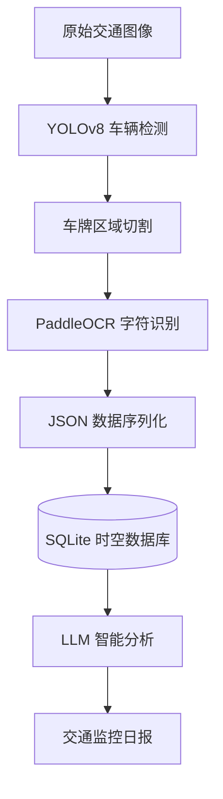

# Traffic-Agent: Intelligent Traffic Monitoring & Data Analysis System

Traffic-Agent 是一个面向智慧交通场景的智能交通监控与数据分析系统（Traffic Intelligence Agent）。

项目融合了计算机视觉（Computer Vision）、数据工程（Data Engineering）与大语言模型（LLM Agent）技术，实现从交通图像感知、车辆信息提取、结构化数据存储到智能分析决策的完整闭环。

系统能够自动识别车辆与车牌信息，将实时交通数据转化为可查询的时空记录，并进一步利用大语言模型生成交通监控分析报告，为智慧城市治理和交通管理提供数据支撑。

---

##  系统架构（System Architecture）



---

##  系统组成（System Components）

### 1️ 视觉感知层（The Eyes）

**技术栈：**

* YOLOv26
* PaddleOCR
* OpenCV

**核心职责：**

现实交通场景中的摄像头产生的是非结构化图像数据。

系统利用 YOLOv8 实现车辆目标检测，并通过 PaddleOCR 提取车牌字符信息，将视觉信息转化为机器可理解的数据。

**能力特点：**

* 实时车辆检测
* 自动车牌定位
* OCR字符识别
* 复杂场景鲁棒处理

---

### 2️ 数据工程层（The Memory）

**技术栈：**

* Python
* SQLite
* JSON

**核心职责：**

视觉检测结果本身无法形成长期价值。

系统构建自动化数据管道，将每次识别结果转化为包含时间戳、位置坐标、车牌信息和识别置信度的结构化记录，并持久化存储至数据库。

**能力特点：**

* 数据标准化
* JSON序列化
* SQLite持久化
* 时空数据管理

---

### 3️ 智能决策层（The Brain）

**技术栈：**

* DeepSeek API
* GPT API
* Prompt Engineering

**核心职责：**

面对海量交通记录，传统方式需要人工分析。

系统自动读取数据库中的车辆信息，通过大语言模型进行数据分析与总结，并自动生成交通监控日报。

**能力特点：**

* 自动数据分析
* 流量趋势总结
* 异常情况识别
* 自动报告生成

---

##  核心功能（Key Features）

### 高精度视觉感知

基于 YOLOv8 与 PaddleOCR 的协同推理框架，实现复杂交通环境下的稳定识别。

### 自动化数据管道

构建从图像输入到数据库存储的端到端自动化流程。

### 时空数据管理

支持车辆记录查询、历史追踪与统计分析。

### AI智能分析

利用大语言模型自动生成交通监控分析报告。

### 模块化架构设计

支持后续扩展：

* 多摄像头接入
* 视频流分析
* 云数据库部署
* 多模态交通管理

---

##  性能验证（Performance & Results）

### 推理效果演示


*图 1：车辆检测与车牌识别结果展示*

---

### 数据库持久化预览

```sql
sqlite> SELECT id,event_id,license_plate,confidence,bbox
FROM vehicle_records
LIMIT 3;
```

| id | event_id             | license_plate | confidence | bbox           |
| -- | -------------------- | ------------- | ---------- | -------------- |
| 1  | CAM_N_001_1782705240 | SU-A88888     | 0.99       | [10,20,100,50] |
| 2  | CAM_N_001_1782705351 | SU-A88888     | 0.99       | [10,20,100,50] |
| 3  | CAM_N_001_1782705351 | SU-B12345     | 0.95       | [15,25,110,55] |

*图 2：SQLite 数据库存储的车辆记录示例*

---

### AI 智能决策展示

系统基于数据库中的结构化交通记录自动生成交通监控分析报告。

<p align="center">
  
</p>

<p align="center">
<b>图 3.</b> 基于车辆时空数据自动生成的交通监控分析报告
</p>

---

##  快速上手（Quick Start）

### 1. 安装依赖

```bash
pip install -r requirements.txt
```

### 2. 运行系统

```bash
python main_inference.py
```

系统将自动完成：

* 车辆检测
* OCR识别
* 数据结构化
* 数据库存储

### 3. 查询数据库

```bash
sqlite3 traffic_agent.db
```

```sql
SELECT *
FROM vehicle_records
LIMIT 5;
```

---


##  项目结构 (Project Structure)

```text
Traffic-Agent/
├── images/                      # 存放 README 相关的演示与结果截图
│   ├── detection_result.png     # 视觉感知推理结果演示
│   ├── database_preview.png     # SQLite 数据库持久化记录预览
│   └── ai_report.png            # LLM 智能分析生成的交通日报演示
│
├── src/                         # 源代码目录 (用于后续模块解耦与重构)
├── database/                    # 数据库配置与迁移脚本目录
│
├── main_inference.py            # 核心模块 1 & 2：YOLOv26 视觉推理与自动入库 (Eyes & Memory)
├── report_generator.py          # 核心模块 3：调用 LLM 引擎生成智能决策报告 (Brain)
├── traffic_agent.db             # 结构化时空数据库文件 (系统运行时自动生成)
│
├── requirements.txt             # 项目环境依赖清单 (pip freeze)
└── README.md                    # 项目核心说明文档
```

---

##  未来工作（Future Work）

* 实时视频流监控
* 多摄像头协同分析
* 云数据库部署
* 异常事件自动告警
* Agent自动决策系统
* RAG交通知识库构建

---

##  License

本项目仅用于学术研究与教学目的。
